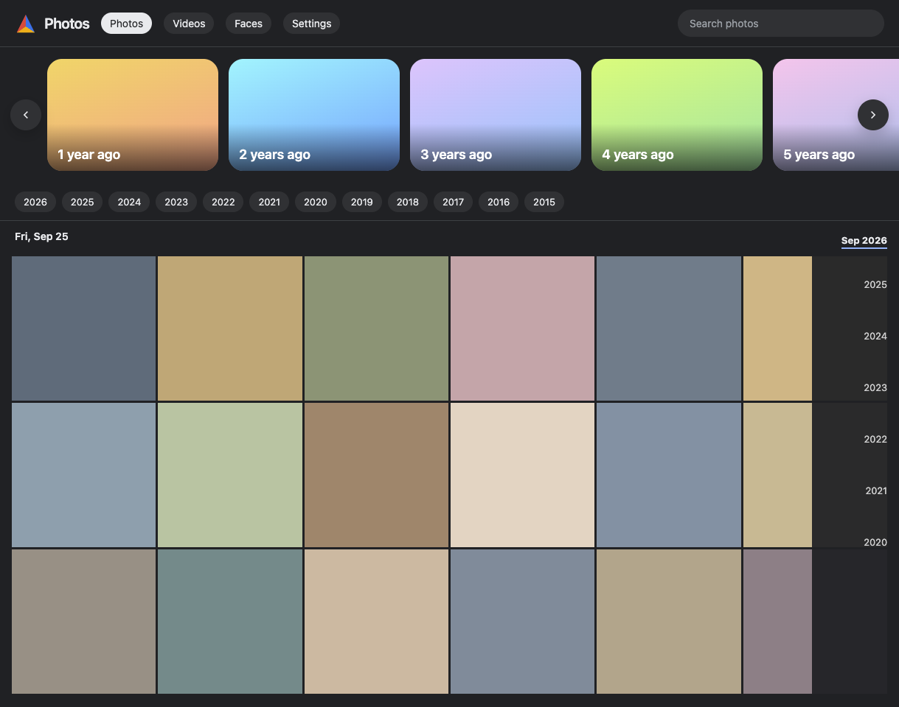
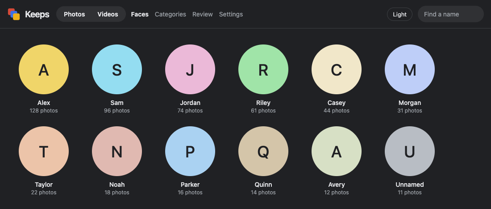
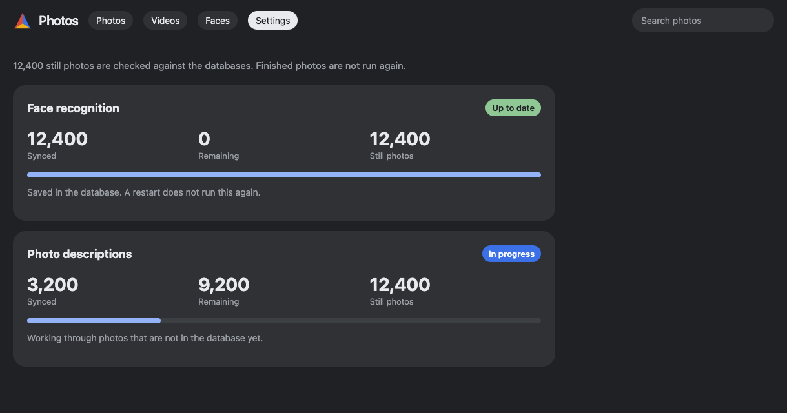

# Local photos

A private gallery for a Google Photos takeout. Photos already live in `Photos/YYYY/MM-Month/`. The site runs on your machine at http://127.0.0.1:8765.

## Screenshots

These pictures use colored placeholders. They are not photos from anyone's library.

### Home



### Faces



### Settings



## What stays off GitHub

The pictures, the face database, the captions, the thumbnails, and the model weights are not in this repo. `.gitignore` keeps them local.

The scripts look for the library at `/Volumes/SamsungT7/Google Photos Backup`. Change `ROOT` in each script if your copy lives somewhere else.

## Download a Google Takeout

Do this once, from the Google account that owns the photos.

1. Open https://takeout.google.com.
2. Choose Deselect all.
3. Turn on Google Photos only.
4. Keep every album if you want the whole library.
5. Create the export as `.zip`. Google splits a large library into several zip files.
6. Wait for the email, then download every part.

Leave the names Google gives them. They look like `takeout-20260928T120000Z-001.zip`. The sorter only sees files that match `takeout-*.zip`. If a browser renames a download, rename it back.

Put every zip in the library folder, next to `sort_photos.py`. Do not put them inside `Photos/`. Do not unzip them yourself.

## Sort the Takeout

Run this only for those zip files. Skip it when the photos are already in `Photos/`, and skip it when you add a loose file later.

The disk needs at least 20 GiB free. The script stops if there is less.

```bash
python3 sort_photos.py
```

It reads the date from the Takeout metadata, then the file name, then the file itself. It copies each photo into `Photos/YYYY/MM-Month/`. Album copies of the same photo are kept once. The original bytes are not edited.

When the copy finishes, you are done with this script.

## Gallery

The server uses only the Python standard library.

```bash
python3 gallery/server.py
```

Open http://127.0.0.1:8765. It reads the folders once, when it starts. A file added after that stays invisible until you start the server again.

Photos, Videos, and Faces share one dark theme. The theme choice is saved in the browser.

Search takes a sentence, and it also has filters you can edit. The Search section below has the query shapes.

## Search

Type a sentence in the search box. The gallery reads a saved person, a year or a date, and photos or videos. The remaining words are matched against the caption and the file name. You can change or clear each filter. The Photos and Videos tabs stay as they are.

- `alex in a carseat video` keeps videos of Alex whose file name or caption mentions a car seat.
- `sam wearing yellow` keeps Sam where the caption or the file name mentions yellow. The word wearing is ignored.
- `sam in 2025` keeps Sam in 2025.
- `sam 2025 july` keeps Sam in July 2025. The month, year, and day can sit in any order.
- `September 2025` and `Sep 25, 2025` use the date stored on the item.
- `screenshots from 2024` keeps screenshots from 2024.
- `documents in 2025` keeps documents from 2025.
- `animals in 2024`, `food`, `nature`, and `vehicles` keep those kinds of photos.
- A place name works like a person name. `sam albany` keeps Sam in Albany when that location is saved on the photo.

A photo with no description is not treated as a screenshot or a document. A photo with no location is not given a place. Videos stay out of these groups.

A saved name matches without caring about capitalization. That includes a person whose name is an ordinary English word.

Videos are not given descriptions, and faces are not saved for them. A video search still limits the grid to videos. It then checks the file name, plus a caption or a face if one was already saved.

## Select

Choose Select, then tap photos or videos. Share sends those files to the system share sheet. Delete asks first, then moves the files to Trash and takes them off the grid. The open photo has the same two actions.

Review is a dashboard for photos that look disposable. You start the check. It looks at the picture, then lists the strongest matches with a reason. Careful, balanced, and aggressive change which photos appear. A careful pass leaves named people off the list. Nothing is deleted until you choose Delete.

## Categories

Categories gathers screenshots, documents, animals, food, nature, vehicles, and places. Open a card to see that group on the photo grid. A photo can be in more than one group. A missing description is not treated as one of these kinds.

Places open on a map. The heat shows how many photos were taken in that spot. Click a spot to see those photos. Places come from coordinates already saved on the file. The gallery does not invent a city when those coordinates have no saved name.

## Faces

Two ONNX files have to sit in `gallery/models/` before the face index will run:

- `10g_bnkps.onnx` finds faces
- `arcface_w600k_r50_batch.onnx` turns a face into a vector

Those weights are not shipped here.

```bash
python3 -m venv gallery/.venv
gallery/.venv/bin/pip install -r requirements.txt
gallery/.venv/bin/python gallery/index_faces.py
```

People in fewer than 10 photos stay off the Faces page. Giving the same name to two groups merges them into one person. Hover a face and use the pen to rename it. An empty name clears it. Opening the face still shows that person's photos.

Finished photos stay in the face database. A gallery restart runs this only for still photos that are not saved yet. You can also run the command above yourself. It skips paths it already finished.

## Descriptions

Captions come from Florence-2, the ONNX build at `onnx-community/Florence-2-base-ft` on Hugging Face. Download these into `gallery/models/florence2/`:

- `tokenizer.json`
- `onnx/vision_encoder_q4f16.onnx`
- `onnx/embed_tokens_q4f16.onnx`
- `onnx/encoder_model_q4f16.onnx`
- `onnx/decoder_model_q4f16.onnx`
- `onnx/decoder_model_merged_q4.onnx`

```bash
gallery/.venv/bin/python gallery/index_captions.py
```

Each still photo gets a short paragraph. Search uses that text. Finished captions stay in the database. A gallery restart describes only still photos that are missing or whose file time changed. A job that is already walking does not see a file added after it made its list. Restart the gallery after that file is in `Photos/`.

## New photos

Do not run `sort_photos.py` for these. That script is only for a fresh `takeout-*.zip`.

Face results and descriptions are saved in their databases. Stopping the gallery does not erase them, and starting it again does not repeat finished photos.

On startup the server compares the folders with those databases. It runs face recognition and descriptions only for still photos that are missing or were changed. Open Settings to see how many are synced, how many are left, and whether a job is in progress.

1. Put the file under `Photos/`.
2. Start `gallery/server.py` again.

The grid picks up the file from that scan. The two jobs then save the new photo and leave the rest alone.

Videos show in the Videos tab. The face index and the caption index only read still photos.

## For agents

Clone, path setup, the indexer, and the model files are in [AGENTS.md](AGENTS.md).
